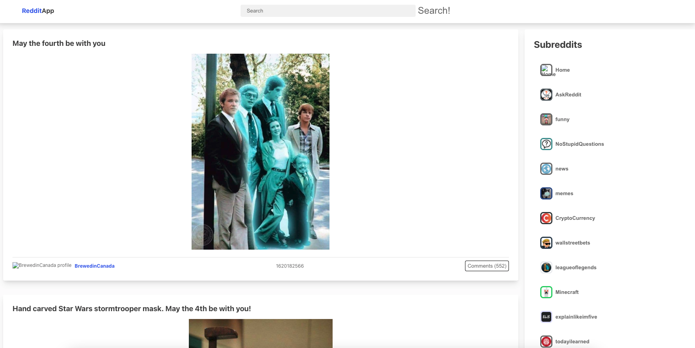

<!-- PROJECT LOGO -->

 

  

  <h3 align="center">Reddit Client</h3>

  

    A reddit client app made with React and Redux
     
     
    <a href="https://kwanchan.co/reddit-client/" target='#'>Visit Site</a>
    ·
    <a href="https://github.com/zcestkc/Reddit-Client/issues">Report Bug</a>
    ·
    <a href="https://github.com/zcestkc/Reddit-Client/issues">Request Feature</a>
  

<!-- TABLE OF CONTENTS -->

## Table of Contents

1. [About the Project](#about-the-project)
2. [Built With](#built-with)
3. [Features](#features)
4. [React](#react)
5. [Redux](#redux)
6. [Bluehost](#bluehost)
7. [SEO](#seo)
8. [Future Work](#future-work)
9. [Contact](#contact)
10. [Acknowledgements](#acknowledgements)

<!-- ABOUT THE PROJECT -->

## About The Project

I created a reddit client website to demonstrate my ability to use React, React-Router and Redux. I have previously used react router in tutorials and I wanted to try it myself and put my own spin on it.

The website is responsive to all screen sizes.

### Built With

- [React JS](https://reactjs.org/)
- [React Router](https://reactrouter.com/)
- [React-Redux](https://react-redux.js.org/)
- HTML/CSS/JS

<!-- USAGE EXAMPLES -->

## Features

- Search bar to display specified posts
- Subreddit menu to browse different topics
- Web app is responsive to all screen sizes

<!-- ROADMAP -->

## React

- Implemented the use of React hooks through the project
- Utilised useEffect to create the countdown timer in the footer
- Applied .map() to create all the image components
- Leverage external libraries to create the form
- Used React Router to switch between pages

<!-- Future Improvements -->

## Redux

- Applied the latest version of Bootstrap to make the website aesthetic and modern
- Leverage the Bootstrap built in Modal and extended it further by using useEffect to turn it into a pop up
- Took advantage of the responsive navbar and added custom CSS to change the default styling.

<!-- 

  

 -->

## Bluehost

- Deployed my site online using Bluehost for the first time
- Connected the site to an actual domain, familarised myself with cPanel functionalities and web hosting

## SEO

Was able to obtain a high score for the Google Lighthouse report, gaining an average of 96

  

## Future work

- Create a user login system with MySQL

<!-- CONTACT -->

## Contact

Kwan Chan - [@kwanchan95](https://twitter.com/kwanchan95)

Project Link: [https://github.com/zcestkc/Reddit-Client/](https://github.com/zcestkc/Reddit-Client/)

<!-- ACKNOWLEDGEMENTS -->

## Acknowledgements

- [Reddit](https://www.reddit.com/)
- [React](https://reactjs.org/)
- [React-Redux](https://react-redux.js.org/)
