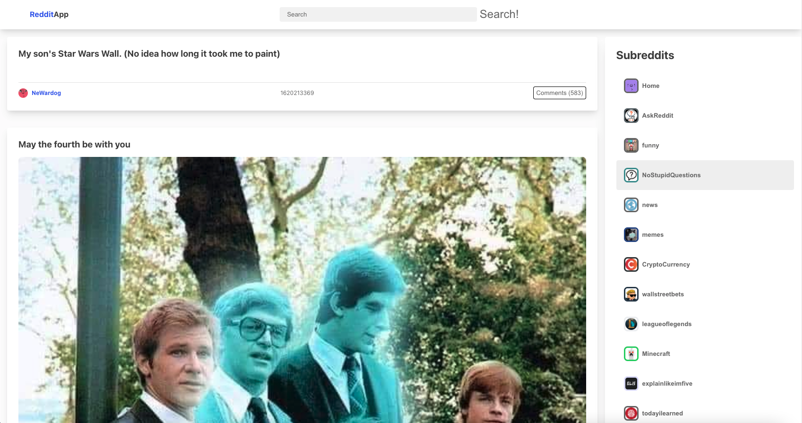
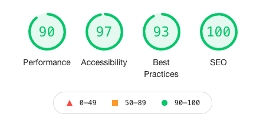

<!-- PROJECT LOGO -->

  

  <h3 align="center">Reddit App</h3>

  

    A reddit client made with React and Redux
     
     
    <a href="https://kwanchan.co/reddit-client/" target='#'>Visit Site</a>
    ·
    <a href="https://github.com/zcestkc/Reddit-Client/issues">Report Bug</a>
    ·
    <a href="https://github.com/zcestkc/Reddit-Client/issues">Request Feature</a>
  

<!-- TABLE OF CONTENTS -->

## Table of Contents

1. [About the Project](#about-the-project)
2. [Built With](#built-with)
3. [Features](#features)
4. [React](#react)
5. [Redux](#redux)
6. [Bluehost](#bluehost)
7. [SEO](#seo)
8. [Future Work](#future-work)
9. [Contact](#contact)
10. [Acknowledgements](#acknowledgements)

<!-- ABOUT THE PROJECT -->

## About The Project

I created a reddit client website to demonstrate my ability to use React and Redux. This is milestone project from Codecademy's Full-Stack Engineer path, bringing together everything I have learnt about front-end development.
The project involves APIs, responsive design and semantically written codes.

### Built With

- [React](https://reactjs.org/)
- [React-Redux](https://react-redux.js.org/)
- HTML/CSS/JS

<!-- USAGE EXAMPLES -->

## Features

- Search bar to display specified posts
- Subreddit menu to browse different topics
- Web app is responsive to all screen sizes

<!-- ROADMAP -->

## React

- 

## Redux

- 

## Bluehost

- Deployed my site online using Bluehost for the first time
- Connected the site to an actual domain, familarised myself with cPanel functionalities and web hosting

## SEO

Obtained a high score for the Google Lighthouse report, gaining an average of 95

  

<!-- Future Improvements -->

## Future work

- Create a user login system with MySQL

<!-- CONTACT -->

## Contact

Kwan Chan - [@kwanchan95](https://twitter.com/kwanchan95)

Project Link: [https://github.com/zcestkc/Reddit-Client/](https://github.com/zcestkc/Reddit-Client/)

<!-- ACKNOWLEDGEMENTS -->

## Acknowledgements

- [Reddit](https://www.reddit.com/)
- [React](https://reactjs.org/)
- [React-Redux](https://react-redux.js.org/)
